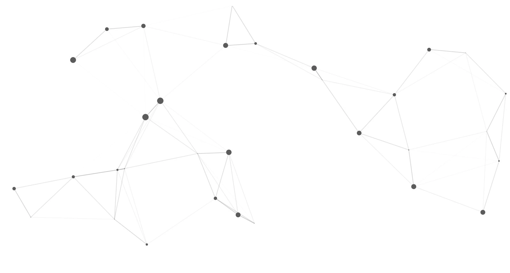

# particles

A quarto shortcode extension to add [Particles.JS](https://vincentgarreau.com/particles.js/) for html format.



## Install

- Requires Quarto >= 1.4.0
- In the root of the quarto project, run in terminal:

```
quarto add royfrancis/quarto-particles
```

This will install the extension under the `_extensions` subdirectory.

## Usage

```
---
title: Particles
filters:
  - particles
---


```

For more examples and usage guide, see [here](https://royfrancis.github.io/quarto-particles).

## Arguments

Pass arguments to the shortcode with `key=value`. Nested keys follow the particles.js schema using dot notation, for example `particles.size.value=3`. All values map directly to the [Particles.js configuration](https://github.com/VincentGarreau/particles.js/) and merge with the defaults shown below.

### Container attributes

| Key | Default | Description |
| --- | --- | --- |
| `id` | auto (`quarto-particles-js-#`) | HTML id for the wrapper div.
| `class` | `quarto-particles-js` | Additional classes appended to the default (the element also gets the generated `id` as a class).
| `style` | *(none)* | Inline styles applied to the wrapper (use to set width, height, background, etc.).
| `config` | *(none)* | JSON string applied to the config. Useful for pasting a full particles.js preset.
| `config-mode` (`config_mode`) | `merge` | When `replace`, the JSON supplied via `config` bypasses defaults; otherwise it merges with them.

The default `quarto-particles-js` class (defined in `_extensions/particles/particles.css`) sets the wrapper to `width: 100%` and `height: 100%`. Supply your own CSS or a `style` attribute when you need fixed dimensions or background colors. Each instance also adds its `id` as a class to make instance-specific styling easier.

### `particles.number`

| Key | Default | Description |
| --- | --- | --- |
| `particles.number.value` | `80` | Base particle count.
| `particles.number.density.enable` | `true` | Enable automatic density scaling.
| `particles.number.density.value_area` | `800` | Area used for density calculation.

### `particles.color`

| Key | Default | Description |
| --- | --- | --- |
| `particles.color.value` | `#5b5b5b` | Particle color (hex, RGB, or array).

### `particles.shape`

| Key | Default | Description |
| --- | --- | --- |
| `particles.shape.type` | `circle` | Shape type (`circle`, `edge`, `triangle`, `polygon`, `star`, `image`).
| `particles.shape.stroke.width` | `0` | Stroke width around shapes.
| `particles.shape.stroke.color` | `#000000` | Stroke color.
| `particles.shape.polygon.nb_sides` | `5` | Number of sides when `type = polygon`.
| `particles.shape.image.src` | `img/github.svg` | Image source when `type = image`.
| `particles.shape.image.width` | `100` | Render width for image shapes.
| `particles.shape.image.height` | `100` | Render height for image shapes.

### `particles.opacity`

| Key | Default | Description |
| --- | --- | --- |
| `particles.opacity.value` | `1` | Base opacity (0–1).
| `particles.opacity.random` | `false` | Randomize each particle's opacity.
| `particles.opacity.anim.enable` | `false` | Animate opacity.
| `particles.opacity.anim.speed` | `1` | Opacity animation speed.
| `particles.opacity.anim.opacity_min` | `0.1` | Minimum opacity during animation.
| `particles.opacity.anim.sync` | `false` | Synchronize opacity animation across particles.

### `particles.size`

| Key | Default | Description |
| --- | --- | --- |
| `particles.size.value` | `5` | Base size in pixels.
| `particles.size.random` | `true` | Randomize particle sizes.
| `particles.size.anim.enable` | `false` | Animate particle size.
| `particles.size.anim.speed` | `40` | Size animation speed.
| `particles.size.anim.size_min` | `0.1` | Minimum size during animation.
| `particles.size.anim.sync` | `false` | Synchronize size animation across particles.

### `particles.line_linked`

| Key | Default | Description |
| --- | --- | --- |
| `particles.line_linked.enable` | `true` | Draw linking lines between particles.
| `particles.line_linked.distance` | `150` | Maximum distance for line connection.
| `particles.line_linked.color` | `#5b5b5b` | Line color.
| `particles.line_linked.opacity` | `0.4` | Line opacity (0–1).
| `particles.line_linked.width` | `1` | Line width in pixels.

### `particles.move`

| Key | Default | Description |
| --- | --- | --- |
| `particles.move.enable` | `true` | Enable particle motion.
| `particles.move.speed` | `1` | Movement speed.
| `particles.move.direction` | `none` | Direction (`none`, `top`, `top-right`, etc.).
| `particles.move.random` | `false` | Randomize movement direction.
| `particles.move.straight` | `false` | Force straight movement.
| `particles.move.out_mode` | `out` | Out-of-bounds behavior (`out`, `bounce`, etc.).
| `particles.move.bounce` | `false` | Enable canvas edge bounce.
| `particles.move.attract.enable` | `false` | Activate particle attraction.
| `particles.move.attract.rotateX` | `600` | Horizontal attraction strength.
| `particles.move.attract.rotateY` | `1200` | Vertical attraction strength.

### `interactivity`

| Key | Default | Description |
| --- | --- | --- |
| `interactivity.detect_on` | `canvas` | Interaction detection element (`canvas` or `window`).
| `interactivity.events.onhover.enable` | `true` | Enable hover interaction.
| `interactivity.events.onhover.mode` | `repulse` | Hover mode (`grab`, `bubble`, `repulse`).
| `interactivity.events.onclick.enable` | `true` | Enable click interaction.
| `interactivity.events.onclick.mode` | `push` | Click mode (`push`, `remove`, `bubble`, `repulse`).
| `interactivity.events.resize` | `true` | Recalculate on canvas resize.

### `interactivity.modes`

| Key | Default | Description |
| --- | --- | --- |
| `interactivity.modes.grab.distance` | `400` | Max grab distance.
| `interactivity.modes.grab.line_linked.opacity` | `1` | Line opacity while grabbing.
| `interactivity.modes.bubble.distance` | `400` | Trigger distance for bubble mode.
| `interactivity.modes.bubble.size` | `40` | Target size during bubble effect.
| `interactivity.modes.bubble.duration` | `2` | Bubble animation duration (s).
| `interactivity.modes.bubble.opacity` | `8` | Target opacity during bubble effect.
| `interactivity.modes.bubble.speed` | `3` | Bubble animation speed.
| `interactivity.modes.repulse.distance` | `50` | Repulse distance.
| `interactivity.modes.repulse.duration` | `0.4` | Repulse effect duration (s).
| `interactivity.modes.push.particles_nb` | `4` | Particles added per click in push mode.
| `interactivity.modes.remove.particles_nb` | `2` | Particles removed per click in remove mode.

### Global

| Key | Default | Description |
| --- | --- | --- |
| `retina_detect` | `true` | Enable retina display detection.

### Example

```

```

## Acknowledgements

Built on [Particles.JS](https://vincentgarreau.com/particles.js/).

---

2025 • Roy Francis
